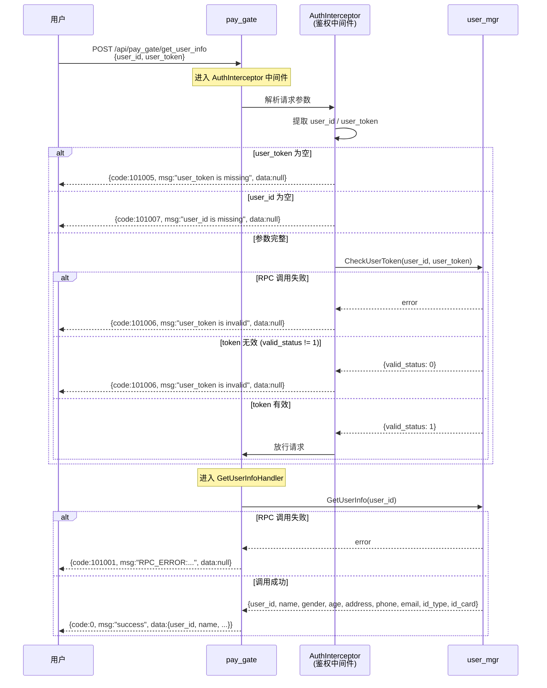

# get_user_info 接口时序图

## 访问链路

```
用户 --> pay_gate --> user_mgr
```

## 时序图



## 流程说明

| 步骤 | 参与者 | 操作 | 说明 |
|------|--------|------|------|
| 1 | 用户 | 发送 HTTP 请求 | POST `/api/pay_gate/get_user_info`，携带 `user_id` 和 `user_token` |
| 2 | pay_gate | 进入鉴权中间件 | `AuthInterceptor` 拦截请求 |
| 3 | 中间件 | 解析请求参数 | 从 JSON body 或表单中提取 `user_id`、`user_token` |
| 4 | 中间件 | 参数校验 | 校验 `user_token` 和 `user_id` 是否存在 |
| 5 | 中间件→user_mgr | 鉴权 RPC | 调用 `CheckUserToken` 校验 token 有效性 |
| 6 | 中间件 | 放行/拦截 | token 有效则放行，无效则返回错误 |
| 7 | pay_gate→user_mgr | 业务 RPC | 调用 `GetUserInfo` 获取用户信息 |
| 8 | pay_gate | 组装响应 | 将 user_mgr 返回的数据包装为统一格式 |
| 9 | pay_gate→用户 | 返回响应 | 返回 `{code, msg, data}` 格式的 JSON |

## 错误码说明

| 错误码 | 含义 | 触发场景 |
|--------|------|----------|
| 101005 | user_token 缺失 | 请求中未携带 `user_token` |
| 101007 | user_id 缺失 | 请求中未携带 `user_id` |
| 101006 | user_token 无效 | token 校验失败（RPC失败或 valid_status != 1） |
| 101001 | RPC 错误 | user_mgr 服务调用失败 |
